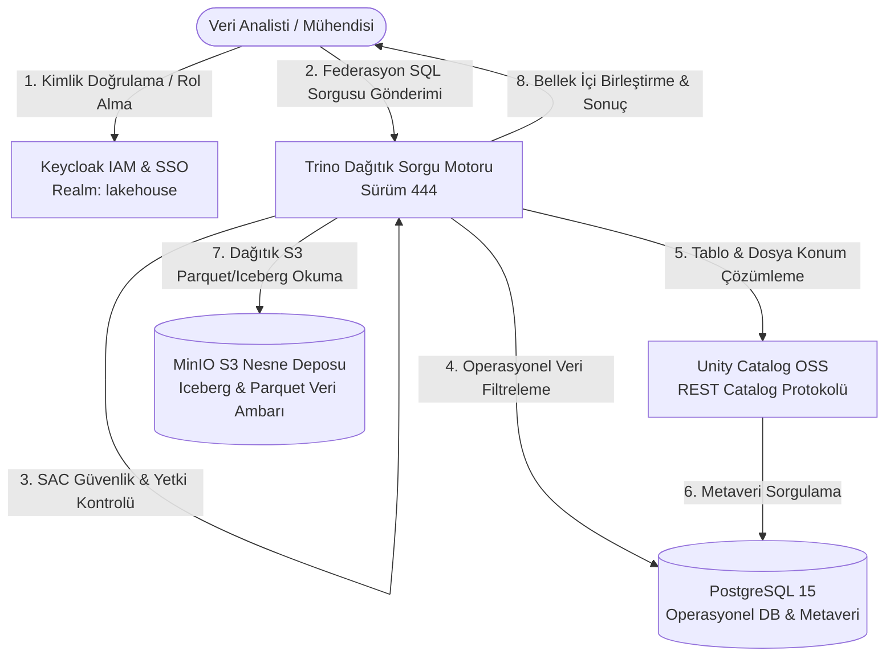

# Modern Açık Kaynak Data Lakehouse & Veri Federasyonu

Bu proje; **PostgreSQL**, **MinIO**, **Unity Catalog OSS**, **Trino** ve **Keycloak** bileşenlerinden oluşan, bulut bağımsız (cloud-agnostic), açık kaynaklı bir **Modern Data Lakehouse (Göl Evi)** ve **Veri Federasyonu** mimarisidir.

İlişkisel operasyonel veritabanları ile S3 uyumlu nesne depolama üzerindeki analitik göl verilerini (Apache Iceberg / Parquet) herhangi bir ETL veri kopyalama sürecine ihtiyaç duymaksızın tek bir SQL sorgusunda birleştirmeyi ve bu mimari üzerinde **Rol Bazlı Erişim Denetimi (RBAC)**, **Satır Bazlı Güvenlik (RLS)** ve **Dinamik Kolon Maskeleme** mekanizmalarını uçtan uca uygulamayı sağlar.

---

## 1. Tanım ve Kapsam

Geleneksel veri mimarilerinde operasyonel sistemlerdeki (OLTP) veriler ile analitik sistemlerdeki (OLAP) büyük verileri birleştirmek için maliyetli, zaman alıcı ve kopyalama gerektiren ETL boru hatları kullanılır. Bu proje;
- **Sıfır ETL Kopyalama:** Dağıtık SQL sorgu motoru aracılığıyla veriyi yerinde (in-place) ve bellek içinde birleştirmeyi,
- **Açık Veri Standartları:** Apache Iceberg tablo formatı ve Unity Catalog açık metaveri standardı ile veri kilitlenmesini (vendor lock-in) önlemeyi,
- **Merkezi Kimlik & Erişim:** Keycloak üzerinden OIDC/OAuth2 tabanlı kimlik yönetimini,
- **Sıfır Güven (Zero-Trust) Veri Yönetişimi:** Tablo, satır ve sütun düzeyinde güvenlik kurallarını (Fine-Grained Access Control) Trino motoru üzerinde zorunlu kılmayı

kapsar.

---

## 2. Genel Mimari

Aşağıdaki şemada göl evi mimarisindeki bileşenlerin etkileşimi ve birleşik sorgu yaşam döngüsü gösterilmektedir:



### Katmanlar ve Görevleri:
1. **Kimlik ve Erişim Katmanı (Keycloak):** Kullanıcı kimlik doğrulamasını, rollerini (`admin`, `data-engineer`, `data-analyst`) ve SSO oturumlarını yönetir.
2. **Dağıtık Sorgu ve Güvenlik Motoru (Trino):** Kullanıcının rolüne göre sistem erişim denetim kurallarını (`rules.json`) işletir, sorguları ayrıştırır ve optimize eder; ilişkisel veritabanı ile nesne deposu arasında bellek içi federasyon sağlar.
3. **Katalog ve Metaveri Katmanı (Unity Catalog OSS):** Analitik tabloların şema, versiyon ve fiziksel dosya konumlarını Iceberg REST Catalog standardıyla Trino'ya sunar. Metaverisini PostgreSQL üzerinde depolar.
4. **Operasyonel İlişkisel Veri Katmanı (PostgreSQL):** Canlı operasyonel tabloları (`users`, `salaries`) ve Unity Catalog ile Keycloak'ın dahili durumlarını saklar.
5. **Analitik Nesne Depolama Katmanı (MinIO):** S3 API uyumlu yerel depolama katmanıdır; analitik tıklama akışı (`clickstream`) ve prim (`bonuses`) veri setlerini Apache Iceberg / Parquet formatında depolar.

---

## 3. Kullanılan Araç ve Yöntemler

- **Kubernetes (K8s):** Tüm göl evi servislerinin yerel kümede (`lakehouse` namespace) yalıtılmış ve ölçeklenebilir şekilde koşturulması.
- **Trino Distributed SQL Engine (v444):** Bellek içi (in-memory) dağıtık sorgulama, ilişkisel itme (pushdown optimization) ve çapraz katalog federasyonu.
- **Unity Catalog OSS (v0.6.0):** Çoklu motor desteğine sahip açık kaynaklı veri ve yapay zeka yönetişim platformu (Iceberg REST Catalog uyumlu).
- **MinIO Object Storage:** Yüksek performanslı, S3 uyumlu nesne deposu; açık Parquet ve Avro dosyalarının saklanması.
- **Apache Iceberg:** Büyük veri kümelerinde ACID işlemleri, zaman yolculuğu (time-travel) ve şema evrimi sağlayan açık tablo formatı.
- **PostgreSQL 15:** ACID uyumlu ilişkisel veri tabanı motoru.
- **Keycloak (v24.0.5):** OAuth 2.0 ve OpenID Connect (OIDC) tabanlı merkezi kimlik sağlayıcı.
- **Trino File-Based System Access Control (SAC):** Rol, tablo, satır (`filter`) ve kolon (`mask` / `allow: false`) düzeyinde dinamik yetkilendirme.

---

## 4. Dosyaların Kısa Açıklamaları

Proje kök dizininde yer alan altyapı ve konfigürasyon dosyaları aşağıda özetlenmiştir:

| Dosya / Dizin | Görevi ve İçeriği |
|---|---|
| `k8s/00-namespace.yaml` | Tüm bileşenlerin konuşlandığı `lakehouse` ortam izolasyonunu sağlayan Kubernetes isim alanı. |
| `k8s/01-postgres.yaml` | Operasyonel veritabanı (`operasyonel_db`), Unity Catalog metaveri tabanı (`unity_catalog`) ve Keycloak için PostgreSQL Deployment ve Service tanımları. |
| `k8s/02-minio.yaml` | MinIO S3 nesne depolama sunucusu ve `warehouse`, `bronze`, `silver`, `gold` bucket'larını otomatik oluşturan başlatma işi (Job). |
| `k8s/03-keycloak.yaml` | Keycloak IAM dağıtımı, `lakehouse` realm konfigürasyonu, OIDC istemcileri ve kullanıcı rolleri. |
| `k8s/04-unitycatalog.yaml` | PostgreSQL metastore bağlantılı Unity Catalog OSS deployment'ı, S3 entegrasyonu ve REST API servisleri. |
| `k8s/05-trino.yaml` | Trino Coordinator pod'u, PostgreSQL kataloğu, Unity Catalog (Iceberg REST) kataloğu ve `rules.json` erişim denetim yapılandırması. |
| `AGENTS.md` | Göl evi mimarisi, veri akış yaşam döngüsü ve federasyon prensiplerini içeren kılavuz. |

---

## 5. Kurulum Aşamaları

Aşağıdaki adımları Kubernetes CLI (`kubectl`) kullanarak sırasıyla uygulayınız.

### Adım 1: Kubernetes Manifestlerini Uygulama
Tüm manifestleri kümenize dağıtın:

```bash
kubectl apply -f k8s/00-namespace.yaml
kubectl apply -f k8s/01-postgres.yaml
kubectl apply -f k8s/02-minio.yaml
kubectl apply -f k8s/03-keycloak.yaml
kubectl apply -f k8s/04-unitycatalog.yaml
kubectl apply -f k8s/05-trino.yaml
```

### Adım 2: Pod Durumlarını Kontrol Etme
Tüm pod'ların `Running` ve hazır (`1/1`) duruma gelmesini bekleyin:

```bash
kubectl get pods -n lakehouse
```

Beklenen çıktı:
```text
NAME                            READY   STATUS      RESTARTS   AGE
keycloak-679665bc87-4n9h8       1/1     Running     0          10m
minio-7b5699f67d-s2bkx          1/1     Running     0          10m
minio-create-buckets-wgqm4      0/1     Completed   0          10m
postgres-5678c8445d-fqfbb       1/1     Running     0          10m
trino-fb8f46866-bffq5           1/1     Running     0          5m
unitycatalog-68d998d567-2nmmt   1/1     Running     0          10m
```

### Adım 3: Yerel Port Yönlendirmeleri (Port-Forward)
Yerel tarayıcınızdan ve geliştirme ortamınızdan arayüzlere erişmek için ayrı terminal pencerelerinde aşağıdaki port yönlendirmelerini başlatın:

```bash
# Trino Web Arayüzü
kubectl port-forward svc/trino 8080:8080 -n lakehouse

# MinIO Konsolu & S3 API
kubectl port-forward svc/minio 9001:9001 -n lakehouse
kubectl port-forward svc/minio 9000:9000 -n lakehouse

# Keycloak Yönetici Konsolu
kubectl port-forward svc/keycloak 8081:8080 -n lakehouse

# Unity Catalog REST API & Swagger UI
kubectl port-forward svc/unitycatalog 8083:8080 -n lakehouse
```

### Adım 4: Web Arayüzlerine Erişim Bilgileri

| Servis | Adres | Kullanıcı Adı | Şifre |
|---|---|---|---|
| **Trino Web UI** | `http://localhost:8080` | `admin` | *(Şifre boş)* |
| **MinIO Console** | `http://localhost:9001` | `minioadmin` | `minioadmin` |
| **Keycloak Admin** | `http://localhost:8081` | `admin` | `admin` *(veya `adminpassword`)* |
| **Unity Catalog API Docs** | `http://localhost:8083/docs/` | *(Gerekmez)* | *(Açık Swagger UI)* |

---

## 6. Demo ve Test

Bu bölümde; operasyonel ve analitik tabloların oluşturulması, temel çapraz federasyon sorgusu, güvenlik kurallarının devreye alınması ve `admin` ile `analyst` rolleri arasındaki yetki farklarının doğrulanması adımları yer almaktadır.

---

### Aşama A: Operasyonel Tabloları PostgreSQL'de Oluşturma

PostgreSQL pod'una doğrudan bağlanarak ilişkisel `users` ve `salaries` tablolarını oluşturup verilerini ekleyin:

```bash
kubectl exec -i -n lakehouse deployment/postgres -- psql -U postgres -d operasyonel_db << 'EOF'
-- 1. Kullanıcılar Tablosu
DROP TABLE IF EXISTS public.users CASCADE;
CREATE TABLE public.users (
    user_id VARCHAR(50) PRIMARY KEY,
    first_name VARCHAR(100) NOT NULL,
    last_name VARCHAR(100) NOT NULL,
    email VARCHAR(255) NOT NULL,
    status VARCHAR(20) NOT NULL
);

INSERT INTO public.users VALUES
('usr_001', 'Ahmet', 'Yilmaz', 'ahmet.yilmaz@lakehouse.local', 'ACTIVE'),
('usr_002', 'Ayse', 'Demir', 'ayse.demir@lakehouse.local', 'ACTIVE'),
('usr_003', 'Mehmet', 'Kaya', 'mehmet.kaya@lakehouse.local', 'ACTIVE'),
('usr_004', 'Fatma', 'Celik', 'fatma.celik@lakehouse.local', 'INACTIVE'),
('usr_005', 'Can', 'Ozturk', 'can.ozturk@lakehouse.local', 'ACTIVE');

-- 2. Hassas Maaş Tablosu
DROP TABLE IF EXISTS public.salaries CASCADE;
CREATE TABLE public.salaries (
    emp_id VARCHAR(10) PRIMARY KEY,
    employee_name VARCHAR(100) NOT NULL,
    department VARCHAR(50) NOT NULL,
    base_salary NUMERIC(10, 2) NOT NULL
);

INSERT INTO public.salaries VALUES
('EMP001', 'Caner Yilmaz', 'Engineering', 95000.00),
('EMP002', 'Elif Demir', 'Product', 88000.00),
('EMP003', 'Murat Kaya', 'Data Science', 92000.00),
('EMP004', 'Zeynep Celik', 'Security', 90000.00),
('EMP005', 'Ahmet Ozturk', 'Operations', 75000.00);
EOF
```

Verilerin eklendiğini doğrulayın:
```bash
kubectl exec -n lakehouse deployment/postgres -- psql -U postgres -d operasyonel_db -c "SELECT * FROM public.salaries;"
```

---

### Aşama B: Trino Kataloglarının Hazır Olduğunu Doğrulama

Trino Coordinator üzerinden katalogları listeleyin:

```bash
kubectl exec -n lakehouse deployment/trino -- trino --execute "SHOW CATALOGS;"
```

Beklenen çıktı:
```text
"jmx"
"memory"
"postgresql"
"system"
"tpcds"
"tpch"
"unity"
```

---

### Aşama C: Temel Çapraz Federasyon Sorgusu (AGENTS.md)

PostgreSQL'deki canlı kullanıcılar (`postgresql.public.users`) ile MinIO nesne deposunda Unity Catalog üzerinden çözümlenen tıklama akışı verilerini (`unity.analytics_schema.clickstream`) bellek içinde birleştiren federasyon sorgusunu çalıştırın:

```bash
kubectl exec -n lakehouse deployment/trino -- trino --execute "
SELECT 
    u.user_id,
    u.first_name,
    u.last_name,
    COUNT(c.event_id) AS total_clicks,
    MAX(c.event_timestamp) AS last_seen_date
FROM 
    postgresql.public.users u
JOIN 
    unity.analytics_schema.clickstream c ON u.user_id = c.user_id
WHERE 
    u.status = 'ACTIVE'
GROUP BY 
    u.user_id, 
    u.first_name, 
    u.last_name
ORDER BY 
    total_clicks DESC
LIMIT 10;
"
```

#### Beklenen Çıktı:
```text
"usr_001","Ahmet","Yilmaz","4","2026-09-12 10:25:00.000000 UTC"
"usr_005","Can","Ozturk","2","2026-09-12 14:15:30.000000 UTC"
"usr_002","Ayse","Demir","2","2026-09-12 11:05:40.000000 UTC"
"usr_003","Mehmet","Kaya","1","2026-09-12 12:30:15.000000 UTC"
```
*(Not: `INACTIVE` statüsündeki Fatma Çelik sorgu motoru tarafından ilişkisel filtreleme itmesiyle otomatik elenmiştir.)*

---

### Aşama D: Rol Bazlı Erişim Denetimi (RBAC), RLS ve Maskeleme Kuralları

Trino pod'una yerleştirilen `/etc/trino/rules.json` güvenlik politikası aşağıdaki kuralları uygular:

1. **`admin.*` Kullanıcısı:** Tüm katalog, şema ve tablolarda tam yetki (`SELECT`, `INSERT`, `DELETE`, `UPDATE`, `OWNERSHIP`).
2. **`analyst.*` Kullanıcısı:**
   - `postgresql.public.salaries`:
     - **Satır Filtreleme (RLS):** `"filter": "department = 'Engineering'"` (Yalnızca Mühendislik çalışanlarını görür).
     - **Kolon Maskeleme:** 
       - `employee_name`: `"mask": "CAST(concat(substr(employee_name, 1, 2), '****') AS varchar(100))"` (İsimlerin ilk 2 harfi hariç kalanı yıldızlanır).
       - `base_salary`: `"mask": "CAST(0.00 AS decimal(10, 2))"` (Maaş değeri 0.00 olarak maskelenir).
   - `unity.finance_schema.bonuses`:
     - **Kolon Kısıtlama:** `annual_bonus` kolonu için `"allow": false` (Bu kolona erişim engellenir).
3. **Diğer Tablolar:** Genel analitik tablolar (`users`, `clickstream`) için tüm kullanıcılara `SELECT` izni tanımlıdır.

---

### Aşama E: Güvenlik Testleri (Admin vs Analyst)

Aşağıdaki CLI komutlarını sırayla çalıştırarak güvenlik mekanizmasını doğrulayın:

#### Test 1: Admin Rolü ile Çapraz Bordro Sorgusu (Tam Yetki)
Admin kullanıcısı ilişkisel maaş tablosu (`salaries`) ile MinIO prim tablosunu (`bonuses`) birleştirir ve toplam bordroyu hesaplar:

```bash
kubectl exec -n lakehouse deployment/trino -- trino --user admin --execute "
SELECT 
    s.emp_id,
    s.employee_name,
    s.department,
    s.base_salary,
    b.annual_bonus,
    (s.base_salary + b.annual_bonus) AS total_compensation,
    b.performance_score
FROM 
    postgresql.public.salaries s
JOIN 
    unity.finance_schema.bonuses b ON s.emp_id = b.emp_id
ORDER BY 
    total_compensation DESC;
"
```

**Admin Sonucu (Başarılı - 5 çalışan eksiksiz):**
```text
"EMP001","Caner Yilmaz","Engineering","95000.00","18500.0","113500.0","4.8"
"EMP003","Murat Kaya","Data Science","92000.00","16000.0","108000.0","4.7"
"EMP004","Zeynep Celik","Security","90000.00","15500.0","105500.0","4.6"
"EMP002","Elif Demir","Product","88000.00","14200.0","102200.0","4.5"
"EMP005","Ahmet Ozturk","Operations","75000.00","9800.0","84800.0","4.1"
```

---

#### Test 2: Analyst Rolü ile Satır Filtreleme (RLS) ve Maskeleme Testi
Analyst kullanıcısı aynı `salaries` tablosunu sorgular:

```bash
kubectl exec -n lakehouse deployment/trino -- trino --user analyst --execute "
SELECT emp_id, employee_name, department, base_salary 
FROM postgresql.public.salaries 
ORDER BY emp_id;
"
```

**Analyst Sonucu (RLS & Kolon Maskeleme Devrede):**
```text
"EMP001","Ca****","Engineering","0.00"
```
- **RLS Kanıtı:** 5 satır yerine sadece `department = 'Engineering'` koşulunu sağlayan 1 satır geldi.
- **İsim Maskeleme Kanıtı:** `Caner Yilmaz` yerine `Ca****` döndü.
- **Maaş Maskeleme Kanıtı:** `95000.00` yerine `0.00` döndü.

---

#### Test 3: Analyst Rolü ile İzin Verilen Kolonları Sorgulama (MinIO / Iceberg)
Analyst kullanıcısı `bonuses` tablosundaki izinli sütunları (`performance_score`, `fiscal_year`) sorgular:

```bash
kubectl exec -n lakehouse deployment/trino -- trino --user analyst --execute "
SELECT emp_id, performance_score, fiscal_year 
FROM unity.finance_schema.bonuses 
ORDER BY emp_id 
LIMIT 3;
"
```

**Sonuç (Başarılı):**
```text
"EMP001","4.8","2026"
"EMP002","4.5","2026"
"EMP003","4.7","2026"
```

---

#### Test 4: Analyst Rolü ile Yasaklı Kolona Erişim Girişimi (`allow: false`)
Analyst kullanıcısı erişimi kısıtlanan `annual_bonus` kolonunu okumaya çalışır:

```bash
kubectl exec -n lakehouse deployment/trino -- trino --user analyst --execute "
SELECT emp_id, annual_bonus 
FROM unity.finance_schema.bonuses;
"
```

**Sonuç (Trino Tarafından Engellendi):**
```text
Query failed: Access Denied: Cannot select from table unity.finance_schema.bonuses
```

---

#### Test 5: Analyst Rolü ile Genel Analitik Tablolarına Erişim
Analyst'in sistemden tamamen engellenmediğini, yetkili olduğu genel tablolara erişebildiğini doğrulayın:

```bash
kubectl exec -n lakehouse deployment/trino -- trino --user analyst --execute "
SELECT u.user_id, u.first_name, u.status, c.event_type 
FROM postgresql.public.users u 
JOIN unity.analytics_schema.clickstream c ON u.user_id = c.user_id 
LIMIT 3;
"
```

**Sonuç (Başarılı):**
```text
"usr_001","Ahmet","ACTIVE","purchase"
"usr_001","Ahmet","ACTIVE","click"
"usr_001","Ahmet","ACTIVE","click"
```

---

## 7. Sonuç

Bu çalışma ile;
1. **Sıfır Lisans ve Altyapı Maliyeti:** Tamamı açık kaynaklı bileşenlerle (Trino, Unity Catalog, MinIO, PostgreSQL, Keycloak) kurumsal ölçekte bir Modern Data Lakehouse ve Veri Federasyonu katmanı kurulmuştur.
2. **Çapraz Veri Federasyonu:** İlişkisel veritabanı (PostgreSQL) ile nesne deposundaki (MinIO Iceberg Parquet) veriler, herhangi bir ETL kopyalama işlemine gerek kalmadan doğrudan Trino üzerinde milisaniyeler seviyesinde birleştirilmiştir.
3. **Uçtan Uca Veri Yönetişimi (Data Governance):** 
   - Tablo düzeyinde erişim denetimi (RBAC),
   - Satır düzeyinde yalıtım (RLS - kullanıcının sadece kendi departmanını görmesi),
   - Kolon düzeyinde dinamik veri maskeleme (`Ca****`, `0.00`),
   - Hassas kolonların tamamen kilitlenmesi (`allow: false`)
   
kuralları Trino motoru üzerinde canlı olarak kanıtlanmıştır. Bu mimari, şirketlerin veri gizliliği (KVKK/GDPR) standartlarına uyumlu bir göl evi altyapısı kurmaları için eksiksiz bir referans model sunmaktadır.

