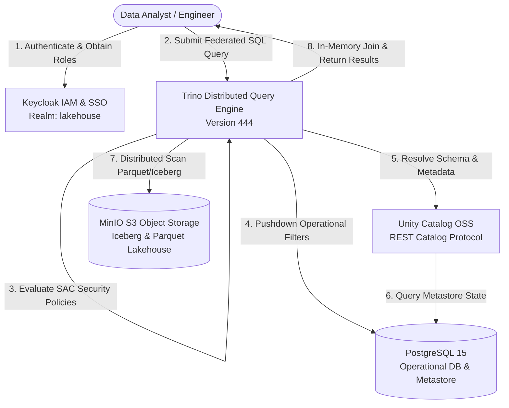

# Modern Open Source Data Lakehouse & Data Federation

This project delivers a vendor-agnostic, open-source **Modern Data Lakehouse** and **Data Federation** architecture powered by **PostgreSQL**, **MinIO**, **Unity Catalog OSS**, **Trino**, and **Keycloak**.

It unifies operational relational databases (OLTP) and analytical object storage data (Apache Iceberg / Parquet) in a single distributed SQL query engine without requiring costly and complex ETL data duplication pipelines. Furthermore, it enforces end-to-end **Role-Based Access Control (RBAC)**, **Row-Level Security (RLS)**, and **Dynamic Column Masking** across federated datasets.

---

## 1. Definition and Scope

In legacy data architectures, integrating operational systems with analytical storage requires fragile, delayed, and expensive ETL pipelines. This platform provides:
- **Zero ETL Duplication:** In-place and in-memory federated querying across transactional and analytical stores using a distributed SQL engine.
- **Open Data Standards:** Prevention of vendor lock-in through the Apache Iceberg open table format and the Unity Catalog open metadata specification.
- **Centralized Identity & Access Management:** Seamless authentication and role-based token delegation via Keycloak using OpenID Connect (OIDC) and OAuth 2.0.
- **Zero-Trust Data Governance:** Enforcing fine-grained access control (table-level RBAC, row-level filtering, and column-level masking) natively within the query engine execution plan.

---

## 2. Overall Architecture

The diagram below illustrates the service topology and the complete lifecycle of a federated SQL query:



### Layer Roles & Responsibilities:
1. **Identity & Access Management (Keycloak):** Manages user authentication, group memberships, and platform roles (`admin`, `data-engineer`, `data-analyst`).
2. **Distributed Query & Security Engine (Trino):** Enforces System Access Control policies (`rules.json`), analyzes and optimizes query execution plans, and executes high-performance in-memory joins across diverse data sources.
3. **Catalog & Governance Metastore (Unity Catalog OSS):** Implements the open Iceberg REST Catalog protocol to serve table schemas, snapshots, and storage locations to Trino while storing metadata in PostgreSQL.
4. **Operational Relational Store (PostgreSQL):** Stores live transactional business tables (`users`, `salaries`) as well as internal state databases for Unity Catalog and Keycloak.
5. **Analytical Object Storage (MinIO):** High-performance, S3-compatible local object store hosting Apache Iceberg Parquet files for analytical datasets such as `clickstream` and `bonuses`.

---

## 3. Tools and Methods Used

- **Kubernetes (K8s):** Container orchestration providing network isolation and scalability across the `lakehouse` namespace.
- **Trino Distributed SQL Engine (v444):** Massively parallel processing (MPP) query engine executing relational pushdowns and cross-catalog federated joins in memory.
- **Unity Catalog OSS (v0.6.0):** Multi-engine data and AI governance platform implementing the open Iceberg REST Catalog specification.
- **MinIO Object Storage:** High-throughput, S3 API-compliant object storage hosting columnar Parquet and metadata files.
- **Apache Iceberg:** High-performance open table format for huge analytic datasets offering ACID transactions, partition evolution, and time-travel.
- **PostgreSQL 15:** ACID-compliant relational operational database.
- **Keycloak (v24.0.5):** Identity and access management provider supporting OIDC, OAuth 2.0, and centralized token claims.
- **Trino File-Based System Access Control (SAC):** Policy-based security mechanism enforcing table permissions, row-level filters (`filter`), and column masks (`mask` / `allow: false`).

---

## 4. Short File Descriptions

All infrastructure definitions are structured as declarative Kubernetes manifests:

| File / Directory | Description |
|---|---|
| `k8s/00-namespace.yaml` | Defines the isolated `lakehouse` namespace for the entire deployment. |
| `k8s/01-postgres.yaml` | Deploys PostgreSQL 15, initializing `operasyonel_db`, `unity_catalog`, and `keycloak` databases along with persistent storage. |
| `k8s/02-minio.yaml` | Deploys MinIO object storage with an initialization Job that automatically provisions storage buckets (`warehouse`, `bronze`, `silver`, `gold`). |
| `k8s/03-keycloak.yaml` | Deploys Keycloak 24 configured with the `lakehouse` realm, client credentials, and user roles. |
| `k8s/04-unitycatalog.yaml` | Deploys Unity Catalog OSS connected to the PostgreSQL metastore and MinIO S3 backend. |
| `k8s/05-trino.yaml` | Deploys the Trino Coordinator, mounting PostgreSQL and Unity Catalog connectors as well as fine-grained SAC rules (`rules.json`). |
| `.gitignore` | Prevents virtual environments, local SQLite databases, and temporary artifacts from polluting the repository. |

---

## 5. Deployment Steps

Follow these steps using the Kubernetes CLI (`kubectl`) to bring up the environment.

### Step 1: Apply Kubernetes Manifests
Deploy all services into your cluster:

```bash
kubectl apply -f k8s/00-namespace.yaml
kubectl apply -f k8s/01-postgres.yaml
kubectl apply -f k8s/02-minio.yaml
kubectl apply -f k8s/03-keycloak.yaml
kubectl apply -f k8s/04-unitycatalog.yaml
kubectl apply -f k8s/05-trino.yaml
```

### Step 2: Verify Pod Health and Readiness
Ensure all pods are in `Running` status and ready (`1/1`):

```bash
kubectl get pods -n lakehouse
```

Expected output:
```text
NAME                            READY   STATUS      RESTARTS   AGE
keycloak-679665bc87-4n9h8       1/1     Running     0          10m
minio-7b5699f67d-s2bkx          1/1     Running     0          10m
minio-create-buckets-wgqm4      0/1     Completed   0          10m
postgres-5678c8445d-fqfbb       1/1     Running     0          10m
trino-fb8f46866-bffq5           1/1     Running     0          5m
unitycatalog-68d998d567-2nmmt   1/1     Running     0          10m
```

### Step 3: Establish Local Port-Forwarding
Forward service ports to your local workstation using separate terminal windows:

```bash
# Trino Web UI & SQL Gateway
kubectl port-forward svc/trino 8080:8080 -n lakehouse

# MinIO Console & S3 API
kubectl port-forward svc/minio 9001:9001 -n lakehouse
kubectl port-forward svc/minio 9000:9000 -n lakehouse

# Keycloak Administration Console
kubectl port-forward svc/keycloak 8081:8080 -n lakehouse

# Unity Catalog REST API & Interactive Swagger UI
kubectl port-forward svc/unitycatalog 8083:8080 -n lakehouse
```

### Step 4: Web UI Access Credentials

| Service | Local Endpoint | Username | Password |
|---|---|---|---|
| **Trino Web UI** | `http://localhost:8080` | `admin` | *(Leave blank)* |
| **MinIO Console** | `http://localhost:9001` | `minioadmin` | `minioadmin` |
| **Keycloak Admin** | `http://localhost:8081` | `admin` | `admin` *(or `adminpassword`)* |
| **Unity Catalog API Docs** | `http://localhost:8083/docs/` | *(None required)* | *(Public Swagger UI)* |

---

## 6. Demo and Verification

This section guides you through seeding relational operational data, verifying catalog connectivity, executing cross-catalog federation queries, and verifying fine-grained RBAC, RLS, and column masking directly from the command line.

---

### Phase A: Operational Database & Tables in PostgreSQL

The PostgreSQL deployment (`k8s/01-postgres.yaml`) automatically provisions the **`operasyonel_db`** database along with both `public.users` and `public.salaries` tables on initial startup.

> [!NOTE]
> **Database Navigation:**
> - When connecting to PostgreSQL via `psql -U postgres` without `-d`, PostgreSQL defaults to the system database `postgres` (`postgres=#`). To access operational tables, you must specify `-d operasyonel_db` or run `\c operasyonel_db`.
> - In Trino, the `operasyonel_db` database is mounted under the catalog name **`postgresql`** (configured in `postgresql.properties`). Therefore, federated queries refer to `postgresql.public.users` and `postgresql.public.salaries`.

To list databases and verify `operasyonel_db` exists:
```bash
kubectl exec -n lakehouse deployment/postgres -- psql -U postgres -c "\l"
```

To verify the seeded operational records in `operasyonel_db`:
```bash
kubectl exec -n lakehouse deployment/postgres -- psql -U postgres -d operasyonel_db -c "SELECT * FROM public.salaries;"
```

---

### Phase B: Verify Trino Catalogs

List active catalogs recognized by the Trino coordinator:

```bash
kubectl exec -n lakehouse deployment/trino -- trino --execute "SHOW CATALOGS;"
```

Expected output:
```text
"jmx"
"memory"
"postgresql"
"system"
"tpcds"
"tpch"
"unity"
```

---

### Phase C: Basic Cross-Catalog Federation Query

Execute a federated query joining transactional data (`postgresql.public.users`) with analytical event data resolved by Unity Catalog on MinIO object storage (`unity.analytics_schema.clickstream`):

```bash
kubectl exec -n lakehouse deployment/trino -- trino --execute "
SELECT 
    u.user_id,
    u.first_name,
    u.last_name,
    COUNT(c.event_id) AS total_clicks,
    MAX(c.event_timestamp) AS last_seen_date
FROM 
    postgresql.public.users u
JOIN 
    unity.analytics_schema.clickstream c ON u.user_id = c.user_id
WHERE 
    u.status = 'ACTIVE'
GROUP BY 
    u.user_id, 
    u.first_name, 
    u.last_name
ORDER BY 
    total_clicks DESC
LIMIT 10;
"
```

#### Expected Output:
```text
"usr_001","Ahmet","Yilmaz","4","2026-09-12 10:25:00.000000 UTC"
"usr_005","Can","Ozturk","2","2026-09-12 14:15:30.000000 UTC"
"usr_002","Ayse","Demir","2","2026-09-12 11:05:40.000000 UTC"
"usr_003","Mehmet","Kaya","1","2026-09-12 12:30:15.000000 UTC"
```
*(Notice: The inactive user `Fatma Celik` is automatically filtered out via relational pushdown before the in-memory join).*

---

### Phase D: Governance Configuration (RBAC, RLS & Column Masking)

The security rules mounted inside Trino at `/etc/trino/rules.json` enforce the following policies:

1. **`admin.*` User:** Full administrative privileges across all catalogs and tables (`SELECT`, `INSERT`, `DELETE`, `UPDATE`, `OWNERSHIP`).
2. **`analyst.*` User:**
   - On `postgresql.public.salaries`:
     - **Row-Level Security (RLS):** `"filter": "department = 'Engineering'"` (The analyst can only see employees in Engineering).
     - **Column Masking:**
       - `employee_name`: `"mask": "CAST(concat(substr(employee_name, 1, 2), '****') AS varchar(100))"` (Only the first two characters remain visible).
       - `base_salary`: `"mask": "CAST(0.00 AS decimal(10, 2))"` (The base salary is masked to 0.00).
   - On `unity.finance_schema.bonuses`:
     - **Column Restriction:** `annual_bonus` column has `"allow": false` (Direct access to this column is denied).
3. **General Fallback (`.*`):** Non-sensitive analytics tables (`users`, `clickstream`) remain accessible with `SELECT` permission for all authenticated identities.

---

### Phase E: Live Security Verification (Admin vs Analyst)

Execute the following verification queries to observe how Trino enforces security policies:

#### Test 1: Admin Role Running the Sensitive Payroll Query (Full Access)
The admin joins relational salaries (`salaries`) with object storage bonuses (`bonuses`) to calculate total compensation:

```bash
kubectl exec -n lakehouse deployment/trino -- trino --user admin --execute "
SELECT 
    s.emp_id,
    s.employee_name,
    s.department,
    s.base_salary,
    b.annual_bonus,
    (s.base_salary + b.annual_bonus) AS total_compensation,
    b.performance_score
FROM 
    postgresql.public.salaries s
JOIN 
    unity.finance_schema.bonuses b ON s.emp_id = b.emp_id
ORDER BY 
    total_compensation DESC;
"
```

**Admin Result (Success - All 5 employees visible unmasked):**
```text
"EMP001","Caner Yilmaz","Engineering","95000.00","18500.0","113500.0","4.8"
"EMP003","Murat Kaya","Data Science","92000.00","16000.0","108000.0","4.7"
"EMP004","Zeynep Celik","Security","90000.00","15500.0","105500.0","4.6"
"EMP002","Elif Demir","Product","88000.00","14200.0","102200.0","4.5"
"EMP005","Ahmet Ozturk","Operations","75000.00","9800.0","84800.0","4.1"
```

---

#### Test 2: Analyst Role Enforcing RLS & Column Masking
The analyst runs the exact same query against `salaries`:

```bash
kubectl exec -n lakehouse deployment/trino -- trino --user analyst --execute "
SELECT emp_id, employee_name, department, base_salary 
FROM postgresql.public.salaries 
ORDER BY emp_id;
"
```

**Analyst Result (RLS & Masking Automatically Applied):**
```text
"EMP001","Ca****","Engineering","0.00"
```
- **RLS Verification:** Only the `Engineering` record is returned (the other 4 departments are completely filtered out).
- **Name Masking Verification:** `Caner Yilmaz` is masked as `Ca****`.
- **Salary Masking Verification:** `95000.00` is replaced with `0.00`.

---

#### Test 3: Analyst Role Reading Permitted Columns (MinIO / Iceberg)
The analyst queries allowed non-sensitive columns (`performance_score`, `fiscal_year`) on `bonuses`:

```bash
kubectl exec -n lakehouse deployment/trino -- trino --user analyst --execute "
SELECT emp_id, performance_score, fiscal_year 
FROM unity.finance_schema.bonuses 
ORDER BY emp_id 
LIMIT 3;
"
```

**Result (Success):**
```text
"EMP001","4.8","2026"
"EMP002","4.5","2026"
"EMP003","4.7","2026"
```

---

#### Test 4: Analyst Role Accessing Forbidden Column (`allow: false`)
The analyst attempts to query the restricted `annual_bonus` column:

```bash
kubectl exec -n lakehouse deployment/trino -- trino --user analyst --execute "
SELECT emp_id, annual_bonus 
FROM unity.finance_schema.bonuses;
"
```

**Result (Blocked by Security Policy):**
```text
Query failed: Access Denied: Cannot select from table unity.finance_schema.bonuses
```

---

#### Test 5: Analyst Role Querying General Analytics Tables
Verify that the analyst is not locked out of authorized non-sensitive tables:

```bash
kubectl exec -n lakehouse deployment/trino -- trino --user analyst --execute "
SELECT u.user_id, u.first_name, u.status, c.event_type 
FROM postgresql.public.users u 
JOIN unity.analytics_schema.clickstream c ON u.user_id = c.user_id 
LIMIT 3;
"
```

**Result (Success):**
```text
"usr_001","Ahmet","ACTIVE","purchase"
"usr_001","Ahmet","ACTIVE","click"
"usr_001","Ahmet","ACTIVE","click"
```

---

## 7. Teardown and Cleanup

To completely remove the Lakehouse environment and reclaim all local resources, follow either of the methods below:

### Step 1: Stop Port-Forwarding Processes
Terminate any background `kubectl port-forward` commands in your open terminal windows using `Ctrl + C`.

### Step 2: Delete Kubernetes Resources

Choose one of the following two methods:

#### Method A: Delete the Entire Namespace (Recommended)
Deleting the `lakehouse` namespace automatically purges all associated deployments, pods, services, jobs, and configmaps:

```bash
kubectl delete namespace lakehouse
```

Verify that the namespace has been deleted:
```bash
kubectl get namespace lakehouse
```
*(Expected output: `Error from server (NotFound): namespaces "lakehouse" not found`)*

#### Method B: Delete Resources Sequentially via Manifests
To delete resources in reverse dependency order:

```bash
kubectl delete -f k8s/05-trino.yaml
kubectl delete -f k8s/04-unitycatalog.yaml
kubectl delete -f k8s/03-keycloak.yaml
kubectl delete -f k8s/02-minio.yaml
kubectl delete -f k8s/01-postgres.yaml
kubectl delete -f k8s/00-namespace.yaml
```

---

## 8. Conclusion

This architecture demonstrates:
1. **Zero Licensing Costs:** Built entirely on open-source technologies (Trino, Unity Catalog, MinIO, PostgreSQL, Keycloak) to provide enterprise-grade data lakehouse capabilities.
2. **Cross-Catalog Data Federation:** Unifying transactional OLTP data (PostgreSQL) with scalable analytical lakehouse tables (MinIO Iceberg Parquet) in memory with zero ETL duplication.
3. **End-to-End Zero-Trust Data Governance:**
   - Table-level access control (RBAC),
   - Row-level filtering (RLS - restricting visibility to department-specific rows),
   - Dynamic column data masking (`Ca****`, `0.00`),
   - Column-level access restrictions (`allow: false`)
   
verified in production-like scenarios on Kubernetes, providing a complete blueprint for enterprise data compliance (GDPR/KVKK) and federated analytics.
