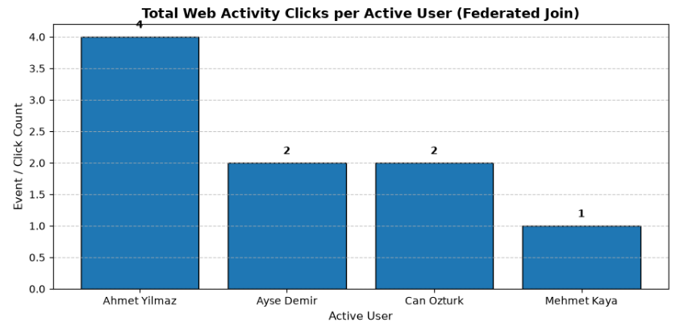
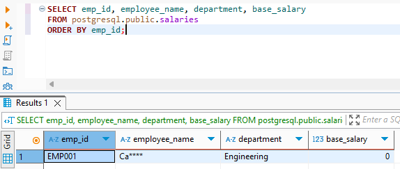
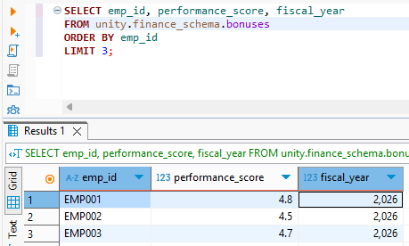

# Modern Open Source Data Lakehouse & Data Federation

This project delivers a vendor-agnostic, open-source **Modern Data Lakehouse** and **Data Federation** architecture powered by **PostgreSQL**, **MinIO**, **Unity Catalog OSS**, **Trino**, and **Keycloak**.

It unifies operational relational databases (OLTP) and analytical object storage data (Apache Iceberg / Parquet) in a single distributed SQL query engine without requiring costly and complex ETL data duplication pipelines. Furthermore, it enforces end-to-end **Role-Based Access Control (RBAC)**, **Row-Level Security (RLS)**, and **Dynamic Column Masking** across federated datasets.

---

## 1. Definition and Scope

In legacy data architectures, integrating operational systems with analytical storage requires fragile, delayed, and expensive ETL pipelines. This platform provides:
- **Zero ETL Duplication:** In-place and in-memory federated querying across transactional and analytical stores using a distributed SQL engine.
- **Open Data Standards:** Prevention of vendor lock-in through the Apache Iceberg open table format and the Unity Catalog open metadata specification.
- **Centralized Identity & Access Management:** Seamless authentication and role-based token delegation via Keycloak using OpenID Connect (OIDC) and OAuth 2.0.
- **Zero-Trust Data Governance:** Enforcing fine-grained access control (table-level RBAC, row-level filtering, and column-level masking) natively within the query engine execution plan.

---

## 2. Overall Architecture

The diagram below illustrates the service topology and the complete lifecycle of a federated SQL query:


### Layer Roles & Responsibilities:
1. **Identity & Access Management (Keycloak):** Manages user authentication, group memberships, and platform roles (`admin`, `data-engineer`, `data-analyst`).
2. **Distributed Query & Security Engine (Trino):** Enforces System Access Control policies (`rules.json`), analyzes and optimizes query execution plans, and executes high-performance in-memory joins across diverse data sources.
3. **Catalog & Governance Metastore (Unity Catalog OSS):** Implements the open Iceberg REST Catalog protocol to serve table schemas, snapshots, and storage locations to Trino while storing metadata in PostgreSQL.
4. **Operational Relational Store (PostgreSQL):** Stores live transactional business tables (`users`, `salaries`) as well as internal state databases for Unity Catalog and Keycloak.
5. **Analytical Object Storage (MinIO):** High-performance, S3-compatible local object store hosting Apache Iceberg Parquet files for analytical datasets such as `clickstream` and `bonuses`.

---

## 3. Tools and Methods Used

- **Kubernetes (K8s):** Container orchestration providing network isolation and scalability across the `lakehouse` namespace.
- **Trino Distributed SQL Engine (v444):** Massively parallel processing (MPP) query engine executing relational pushdowns and cross-catalog federated joins in memory.
- **Unity Catalog OSS (v0.6.0):** Multi-engine data and AI governance platform implementing the open Iceberg REST Catalog specification.
- **MinIO Object Storage:** High-throughput, S3 API-compliant object storage hosting columnar Parquet and metadata files.
- **Apache Iceberg:** High-performance open table format for huge analytic datasets offering ACID transactions, partition evolution, and time-travel.
- **PostgreSQL 15:** ACID-compliant relational operational database.
- **Keycloak (v24.0.5):** Identity and access management provider supporting OIDC, OAuth 2.0, and centralized token claims.
- **Trino File-Based System Access Control (SAC):** Policy-based security mechanism enforcing table permissions, row-level filters (`filter`), and column masks (`mask` / `allow: false`).

---

## 4. Short File Descriptions

All infrastructure definitions are structured as declarative Kubernetes manifests:

| File / Directory | Description |
|---|---|
| `k8s/00-namespace.yaml` | Defines the isolated `lakehouse` namespace for the entire deployment. |
| `k8s/01-postgres.yaml` | Deploys PostgreSQL 15, initializing `operasyonel_db`, `unity_catalog`, and `keycloak` databases along with persistent storage. |
| `k8s/02-minio.yaml` | Deploys MinIO object storage with an initialization Job that automatically provisions storage buckets (`warehouse`, `bronze`, `silver`, `gold`). |
| `k8s/03-keycloak.yaml` | Deploys Keycloak 24 configured with the `lakehouse` realm, client credentials, and user roles. |
| `k8s/04-unitycatalog.yaml` | Deploys Unity Catalog OSS connected to the PostgreSQL metastore and MinIO S3 backend. |
| `k8s/05-trino.yaml` | Deploys the Trino Coordinator, mounting PostgreSQL and Unity Catalog connectors as well as fine-grained SAC rules (`rules.json`). |
| `lakehouse_quickstart.ipynb` | Complete interactive Jupyter Notebook for automated lakehouse seeding, cross-catalog federation queries, and data visualization. |
| `.gitignore` | Prevents virtual environments, local SQLite databases, and temporary artifacts from polluting the repository. |

---

## 5. Deployment Steps

Follow these steps using the Kubernetes CLI (`kubectl`) to bring up the environment.

### Step 1: Apply Kubernetes Manifests
Deploy all services into your cluster:

```bash
kubectl apply -f k8s/00-namespace.yaml
kubectl apply -f k8s/01-postgres.yaml
kubectl apply -f k8s/02-minio.yaml
kubectl apply -f k8s/03-keycloak.yaml
kubectl apply -f k8s/04-unitycatalog.yaml
kubectl apply -f k8s/05-trino.yaml
```

### Step 2: Verify Pod Health and Readiness
Ensure all pods are in `Running` status and ready (`1/1`):

```bash
kubectl get pods -n lakehouse
```

Expected output:
```text
NAME                            READY   STATUS      RESTARTS   AGE
keycloak-679665bc87-4n9h8       1/1     Running     0          10m
minio-7b5699f67d-s2bkx          1/1     Running     0          10m
minio-create-buckets-wgqm4      0/1     Completed   0          10m
postgres-5678c8445d-fqfbb       1/1     Running     0          10m
trino-fb8f46866-bffq5           1/1     Running     0          5m
unitycatalog-68d998d567-2nmmt   1/1     Running     0          10m
```

### Step 3: Establish Local Port-Forwarding
Forward service ports to your local workstation using separate terminal windows:

```bash
# Trino Web UI & SQL Gateway
kubectl port-forward svc/trino 8080:8080 -n lakehouse

# MinIO Console & S3 API
kubectl port-forward svc/minio 9001:9001 -n lakehouse
kubectl port-forward svc/minio 9000:9000 -n lakehouse

# Keycloak Administration Console
kubectl port-forward svc/keycloak 8081:8080 -n lakehouse

# Unity Catalog REST API & Interactive Swagger UI
kubectl port-forward svc/unitycatalog 8083:8080 -n lakehouse
```

### Step 4: Web UI Access Credentials

| Service | Local Endpoint | Username | Password |
|---|---|---|---|
| **Trino Web UI** | `http://localhost:8080` | `admin` | *(Leave blank)* |
| **MinIO Console** | `http://localhost:9001` | `minioadmin` | `minioadmin` |
| **Keycloak Admin** | `http://localhost:8081` | `admin` | `admin` |
| **Unity Catalog API Docs** | `http://localhost:8083/docs/` | *(None required)* | *(Public Swagger UI)* |

---

## 6. Demo and Verification

This section guides you through seeding relational operational data, verifying catalog connectivity, executing cross-catalog federation queries, and verifying fine-grained RBAC, RLS, and column masking directly from the command line.

---

### Phase A: Seed Operational Tables in PostgreSQL

Connect directly to the PostgreSQL pod to seed both the general `users` table and the sensitive `salaries` table in `operasyonel_db`:

```bash
kubectl exec -i -n lakehouse deployment/postgres -- psql -U postgres -d operasyonel_db << 'EOF'
-- 1. General Operational Users Table
DROP TABLE IF EXISTS public.users CASCADE;
CREATE TABLE public.users (
    user_id VARCHAR(50) PRIMARY KEY,
    first_name VARCHAR(100) NOT NULL,
    last_name VARCHAR(100) NOT NULL,
    email VARCHAR(255) NOT NULL,
    status VARCHAR(20) NOT NULL
);

INSERT INTO public.users VALUES
('usr_001', 'Ahmet', 'Yilmaz', 'ahmet.yilmaz@lakehouse.local', 'ACTIVE'),
('usr_002', 'Ayse', 'Demir', 'ayse.demir@lakehouse.local', 'ACTIVE'),
('usr_003', 'Mehmet', 'Kaya', 'mehmet.kaya@lakehouse.local', 'ACTIVE'),
('usr_004', 'Fatma', 'Celik', 'fatma.celik@lakehouse.local', 'INACTIVE'),
('usr_005', 'Can', 'Ozturk', 'can.ozturk@lakehouse.local', 'ACTIVE');

-- 2. Sensitive Payroll Table
DROP TABLE IF EXISTS public.salaries CASCADE;
CREATE TABLE public.salaries (
    emp_id VARCHAR(10) PRIMARY KEY,
    employee_name VARCHAR(100) NOT NULL,
    department VARCHAR(50) NOT NULL,
    base_salary NUMERIC(10, 2) NOT NULL
);

INSERT INTO public.salaries VALUES
('EMP001', 'Caner Yilmaz', 'Engineering', 95000.00),
('EMP002', 'Elif Demir', 'Product', 88000.00),
('EMP003', 'Murat Kaya', 'Data Science', 92000.00),
('EMP004', 'Zeynep Celik', 'Security', 90000.00),
('EMP005', 'Ahmet Ozturk', 'Operations', 75000.00);
EOF
```

Verify seeded records:
```bash
kubectl exec -n lakehouse deployment/postgres -- psql -U postgres -d operasyonel_db -c "SELECT * FROM public.users;"
kubectl exec -n lakehouse deployment/postgres -- psql -U postgres -d operasyonel_db -c "SELECT * FROM public.salaries;"
```

---

### Phase B: Interactive Lakehouse Workflow & Seeding (JupyterLab Walkthrough)

The complete Lakehouse seeding, cross-catalog federation query execution, and analytical visualization can be executed interactively via JupyterLab using the bundled notebook [`lakehouse_quickstart.ipynb`]

To launch JupyterLab from the workspace root:
```bash
jupyter lab
```

Below is the complete, cell-by-cell walkthrough, Python source code, and exact execution outputs from `lakehouse_quickstart.ipynb`:

#### Prerequisites: Ensure Kubernetes Port-Forwarding is Active
Make sure the following services are forwarded from your Kubernetes cluster in separate terminals:
```bash
kubectl port-forward svc/trino 8080:8080 -n lakehouse
kubectl port-forward svc/minio 9000:9000 -n lakehouse
kubectl port-forward svc/unitycatalog 8083:8080 -n lakehouse
```

---

#### Cell 1: Import Core Dependencies
```python
import os
import sys
import uuid
import subprocess
from datetime import datetime, timezone

import requests
import pandas as pd
import pyarrow as pa
from pyiceberg.catalog.sql import SqlCatalog
from pyiceberg.schema import Schema
from pyiceberg.types import NestedField, StringType, TimestamptzType, DoubleType, IntegerType
from minio import Minio
from trino.dbapi import connect
import matplotlib.pyplot as plt

print("All libraries imported successfully!")
```

**Cell 1 Output:**
```text
All libraries imported successfully!
```

---

#### Cell 2: Create Catalog and Schemas via Unity Catalog REST API
We use the REST API of Unity Catalog (`http://localhost:8083`) to register the catalog and schemas:

```python
UC_BASE = "http://localhost:8083/api/2.1/unity-catalog"

# 1. Create 'unity' Catalog
res = requests.post(f"{UC_BASE}/catalogs", json={"name": "unity", "comment": "Main Lakehouse Catalog"})
print("Catalog 'unity':", res.status_code, res.json() if res.status_code == 200 else res.text)

# 2. Create 'analytics_schema'
res = requests.post(f"{UC_BASE}/schemas", json={"name": "analytics_schema", "catalog_name": "unity"})
print("Schema 'analytics_schema':", res.status_code, res.json() if res.status_code == 200 else res.text)

# 3. Create 'finance_schema'
res = requests.post(f"{UC_BASE}/schemas", json={"name": "finance_schema", "catalog_name": "unity"})
print("Schema 'finance_schema':", res.status_code, res.json() if res.status_code == 200 else res.text)
```

**Cell 2 Output:**
```text
Catalog 'unity': 200 {'name': 'unity', 'comment': 'Main Lakehouse Catalog', 'properties': {}, 'owner': None, 'created_at': 1789228120478, 'created_by': None, 'updated_at': 1789228120478, 'updated_by': None, 'id': '1d48d0aa-20d7-4c50-884d-a6cd68bf209c', 'storage_root': None, 'storage_location': None}
Schema 'analytics_schema': 200 {'name': 'analytics_schema', 'catalog_name': 'unity', 'comment': None, 'properties': {}, 'full_name': 'unity.analytics_schema', 'owner': None, 'created_at': 1789228120554, 'created_by': None, 'updated_at': 1789228120554, 'updated_by': None, 'schema_id': '344cc283-12a8-4a2f-802b-03b40be3a379', 'storage_root': None, 'storage_location': None}
Schema 'finance_schema': 200 {'name': 'finance_schema', 'catalog_name': 'unity', 'comment': None, 'properties': {}, 'full_name': 'unity.finance_schema', 'owner': None, 'created_at': 1789228120575, 'created_by': None, 'updated_at': 1789228120575, 'updated_by': None, 'schema_id': '003aca41-2218-4a2d-86b2-744fd5392a29', 'storage_root': None, 'storage_location': None}
```

---

#### Cell 3: Ingest Apache Iceberg Tables into MinIO S3
We use `PyIceberg` to create native Iceberg tables on MinIO (`s3://warehouse/`), write Parquet data files, and generate metadata manifests:

```python
catalog = SqlCatalog(
    "lakehouse",
    **{
        "uri": "sqlite:///:memory:",
        "warehouse": "s3://warehouse",
        "s3.endpoint": "http://localhost:9000",
        "s3.access-key-id": "minioadmin",
        "s3.secret-access-key": "minioadmin",
        "s3.region": "us-east-1",
    },
)

minio_client = Minio("localhost:9000", access_key="minioadmin", secret_key="minioadmin", secure=False)

# --- Table 1: clickstream ---
try:
    catalog.create_namespace("analytics_schema")
except Exception:
    pass

click_schema = Schema(
    NestedField(field_id=1, name="event_id", field_type=StringType(), required=True),
    NestedField(field_id=2, name="user_id", field_type=StringType(), required=True),
    NestedField(field_id=3, name="event_type", field_type=StringType(), required=True),
    NestedField(field_id=4, name="page_url", field_type=StringType(), required=True),
    NestedField(field_id=5, name="event_timestamp", field_type=TimestamptzType(), required=True),
)

try:
    catalog.drop_table(("analytics_schema", "clickstream"))
except Exception:
    pass

click_table = catalog.create_table(
    identifier=("analytics_schema", "clickstream"),
    schema=click_schema,
    location="s3://warehouse/analytics_schema/clickstream",
)

click_data = [
    ("evt_001", "usr_001", "page_view", "/home", datetime(2026, 9, 12, 10, 15, 0, tzinfo=timezone.utc)),
    ("evt_002", "usr_001", "click", "/products", datetime(2026, 9, 12, 10, 18, 22, tzinfo=timezone.utc)),
    ("evt_003", "usr_001", "click", "/cart", datetime(2026, 9, 12, 10, 20, 5, tzinfo=timezone.utc)),
    ("evt_010", "usr_001", "purchase", "/thank-you", datetime(2026, 9, 12, 10, 25, 0, tzinfo=timezone.utc)),
    ("evt_004", "usr_002", "page_view", "/home", datetime(2026, 9, 12, 11, 0, 10, tzinfo=timezone.utc)),
    ("evt_005", "usr_002", "click", "/pricing", datetime(2026, 9, 12, 11, 5, 40, tzinfo=timezone.utc)),
    ("evt_006", "usr_003", "page_view", "/blog", datetime(2026, 9, 12, 12, 30, 15, tzinfo=timezone.utc)),
    ("evt_007", "usr_004", "page_view", "/login", datetime(2026, 9, 12, 13, 0, 0, tzinfo=timezone.utc)),
    ("evt_008", "usr_005", "page_view", "/products", datetime(2026, 9, 12, 14, 10, 0, tzinfo=timezone.utc)),
    ("evt_009", "usr_005", "click", "/checkout", datetime(2026, 9, 12, 14, 15, 30, tzinfo=timezone.utc)),
]

click_arrow = pa.Table.from_arrays(
    [
        pa.array([r[0] for r in click_data], type=pa.string()),
        pa.array([r[1] for r in click_data], type=pa.string()),
        pa.array([r[2] for r in click_data], type=pa.string()),
        pa.array([r[3] for r in click_data], type=pa.string()),
        pa.array([r[4] for r in click_data], type=pa.timestamp("us", tz="UTC")),
    ],
    schema=click_table.schema().as_arrow(),
)
click_table.append(click_arrow)
print("Clickstream table created in MinIO:", click_table.metadata_location)

# --- Table 2: bonuses ---
try:
    catalog.create_namespace("finance_schema")
except Exception:
    pass

bonus_schema = Schema(
    NestedField(field_id=1, name="emp_id", field_type=StringType(), required=True),
    NestedField(field_id=2, name="annual_bonus", field_type=DoubleType(), required=True),
    NestedField(field_id=3, name="performance_score", field_type=DoubleType(), required=True),
    NestedField(field_id=4, name="fiscal_year", IntegerType(), required=True),
)

try:
    catalog.drop_table(("finance_schema", "bonuses"))
except Exception:
    pass

bonus_table = catalog.create_table(
    identifier=("finance_schema", "bonuses"),
    schema=bonus_schema,
    location="s3://warehouse/finance_schema/bonuses",
)

bonus_data = [
    ("EMP001", 18500.0, 4.8, 2026),
    ("EMP002", 14200.0, 4.5, 2026),
    ("EMP003", 16000.0, 4.7, 2026),
    ("EMP004", 15500.0, 4.6, 2026),
    ("EMP005", 9800.0, 4.1, 2026),
]

bonus_arrow = pa.Table.from_arrays(
    [
        pa.array([r[0] for r in bonus_data], type=pa.string()),
        pa.array([r[1] for r in bonus_data], type=pa.float64()),
        pa.array([r[2] for r in bonus_data], type=pa.float64()),
        pa.array([r[3] for r in bonus_data], type=pa.int32()),
    ],
    schema=bonus_table.schema().as_arrow(),
)
bonus_table.append(bonus_arrow)
print("Bonuses table created in MinIO:", bonus_table.metadata_location)
```

**Cell 3 Output:**
```text
Clickstream table created in MinIO: s3://warehouse/analytics_schema/clickstream/metadata/00001-60a7d132-249c-4f84-ab95-b55ac03c5e20.metadata.json
Bonuses table created in MinIO: s3://warehouse/finance_schema/bonuses/metadata/00001-c6b37c52-cb2a-462f-8aa5-f364235412c5.metadata.json
```

---

#### Cell 4: Register Tables in Unity Catalog
We copy the generated Iceberg metadata manifests to Unity Catalog and register the tables in the `unity_catalog` PostgreSQL metastore:

```python
uc_pod = subprocess.check_output(
    ["kubectl", "get", "pods", "-n", "lakehouse", "-l", "app=unitycatalog", "-o", "jsonpath={.items[0].metadata.name}"]
).decode("utf-8").strip()

# 1. Copy Clickstream metadata to UC pod
click_meta_key = click_table.metadata_location.replace("s3://warehouse/", "")
click_res = minio_client.get_object("warehouse", click_meta_key)
click_meta_bytes = click_res.read()
click_res.close()

remote_click_dir = "/home/unitycatalog/etc/data/external/unity/analytics_schema/tables/clickstream/metadata"
remote_click_file = f"{remote_click_dir}/00001.metadata.json"
subprocess.run(["kubectl", "exec", "-n", "lakehouse", uc_pod, "--", "mkdir", "-p", remote_click_dir], check=True)
subprocess.run(
    ["kubectl", "exec", "-i", "-n", "lakehouse", uc_pod, "--", "sh", "-c", f"cat > {remote_click_file}"],
    input=click_meta_bytes,
    check=True,
)

# 2. Copy Bonuses metadata to UC pod
bonus_meta_key = bonus_table.metadata_location.replace("s3://warehouse/", "")
bonus_res = minio_client.get_object("warehouse", bonus_meta_key)
bonus_meta_bytes = bonus_res.read()
bonus_res.close()

remote_bonus_dir = "/home/unitycatalog/etc/data/external/unity/finance_schema/tables/bonuses/metadata"
remote_bonus_file = f"{remote_bonus_dir}/00001.metadata.json"
subprocess.run(["kubectl", "exec", "-n", "lakehouse", uc_pod, "--", "mkdir", "-p", remote_bonus_dir], check=True)
subprocess.run(
    ["kubectl", "exec", "-i", "-n", "lakehouse", uc_pod, "--", "sh", "-c", f"cat > {remote_bonus_file}"],
    input=bonus_meta_bytes,
    check=True,
)

# 3. Register in PostgreSQL unity_catalog database
psql_reg = f"""
DO $$
DECLARE
    v_catalog_id uuid;
    v_analytics_id uuid;
    v_finance_id uuid;
BEGIN
    SELECT id INTO v_catalog_id FROM uc_catalogs WHERE name = 'unity';
    SELECT id INTO v_analytics_id FROM uc_schemas WHERE name = 'analytics_schema' AND catalog_id = v_catalog_id;
    SELECT id INTO v_finance_id FROM uc_schemas WHERE name = 'finance_schema' AND catalog_id = v_catalog_id;

    -- uc_tables clickstream
    DELETE FROM uc_tables WHERE name = 'clickstream' AND schema_id = v_analytics_id;
    INSERT INTO uc_tables (
        id, name, column_count, data_source_format, schema_id, type,
        uniform_iceberg_metadata_location, url, created_at, updated_at
    ) VALUES (
        gen_random_uuid(), 'clickstream', 0, 'DELTA', v_analytics_id, 'EXTERNAL',
        'file://{remote_click_file}', 's3://warehouse/analytics_schema/clickstream', NOW(), NOW()
    );

    -- uc_tables bonuses
    DELETE FROM uc_tables WHERE name = 'bonuses' AND schema_id = v_finance_id;
    INSERT INTO uc_tables (
        id, name, column_count, data_source_format, schema_id, type,
        uniform_iceberg_metadata_location, url, created_at, updated_at
    ) VALUES (
        gen_random_uuid(), 'bonuses', 0, 'DELTA', v_finance_id, 'EXTERNAL',
        'file://{remote_bonus_file}', 's3://warehouse/finance_schema/bonuses', NOW(), NOW()
    );
END $$;
"""

subprocess.run(
    ["kubectl", "exec", "-i", "-n", "lakehouse", "deployment/postgres", "--", "psql", "-U", "postgres", "-d", "unity_catalog"],
    input=psql_reg.encode("utf-8"),
    check=True,
)
print("Tables successfully registered in Unity Catalog!")
```

**Cell 4 Output:**
```text
Tables successfully registered in Unity Catalog!
```

---

#### Cell 5: Federated Cross-Catalog SQL with Trino & Pandas
Query Trino across PostgreSQL (`postgresql.public.users`) and Unity Catalog/MinIO (`unity.analytics_schema.clickstream`) in a single query:

```python
# Helper function to execute query and format as Pandas DataFrame
def run_query(sql, conn):
    cur = conn.cursor()
    cur.execute(sql.strip().rstrip(";"))
    rows = cur.fetchall()
    cols = [d[0] for d in cur.description]
    return pd.DataFrame(rows, columns=cols)

conn = connect(
    host="localhost",
    port=8080,
    user="admin",
    catalog="unity",
    schema="analytics_schema",
)

query = """
SELECT 
    u.user_id,
    u.first_name,
    u.last_name,
    COUNT(c.event_id) AS total_clicks,
    MAX(c.event_timestamp) AS last_seen_date
FROM 
    postgresql.public.users u
JOIN 
    unity.analytics_schema.clickstream c ON u.user_id = c.user_id
WHERE 
    u.status = 'ACTIVE'
GROUP BY 
    u.user_id, u.first_name, u.last_name
ORDER BY 
    total_clicks DESC
"""

df_clicks = run_query(query, conn)
display(df_clicks)
```

**Cell 5 Output (Pandas DataFrame):**
| Index | `user_id` | `first_name` | `last_name` | `total_clicks` | `last_seen_date` |
|---|---|---|---|---|---|
| **0** | `usr_001` | Ahmet | Yilmaz | 4 | `2026-09-12 10:25:00+00:00` |
| **1** | `usr_005` | Can | Ozturk | 2 | `2026-09-12 14:15:30+00:00` |
| **2** | `usr_002` | Ayse | Demir | 2 | `2026-09-12 11:05:40+00:00` |
| **3** | `usr_003` | Mehmet | Kaya | 1 | `2026-09-12 12:30:15+00:00` |

---

#### Cell 6: Sensitive Compensation Query (Salaries + Bonuses)
Joining PostgreSQL operational salaries with object storage bonuses:

```python
payroll_query = """
SELECT 
    s.emp_id,
    s.employee_name,
    s.department,
    s.base_salary,
    b.annual_bonus,
    (s.base_salary + b.annual_bonus) AS total_compensation,
    b.performance_score
FROM 
    postgresql.public.salaries s
JOIN 
    unity.finance_schema.bonuses b ON s.emp_id = b.emp_id
ORDER BY 
    total_compensation DESC
"""

df_payroll = run_query(payroll_query, conn)
display(df_payroll)
```

**Cell 6 Output (Pandas DataFrame):**
| Index | `emp_id` | `employee_name` | `department` | `base_salary` | `annual_bonus` | `total_compensation` | `performance_score` |
|---|---|---|---|---|---|---|---|
| **0** | `EMP001` | Caner Yilmaz | Engineering | 95000.00 | 18500.0 | 113500.0 | 4.8 |
| **1** | `EMP003` | Murat Kaya | Data Science | 92000.00 | 16000.0 | 108000.0 | 4.7 |
| **2** | `EMP004` | Zeynep Celik | Security | 90000.00 | 15500.0 | 105500.0 | 4.6 |
| **3** | `EMP002` | Elif Demir | Product | 88000.00 | 14200.0 | 102200.0 | 4.5 |
| **4** | `EMP005` | Ahmet Ozturk | Operations | 75000.00 | 9800.0 | 84800.0 | 4.1 |

---

#### Cell 7: Visualizing Analytical Insights
Plotting user engagement metrics directly from the federated dataset using Matplotlib:

```python
plt.figure(figsize=(9, 4.5))
bars = plt.bar(
    df_clicks["first_name"] + " " + df_clicks["last_name"],
    df_clicks["total_clicks"],
    color="#1f77b4",
    edgecolor="black",
)
plt.title("Total Web Activity Clicks per Active User (Federated Join)", fontsize=13, fontweight="bold")
plt.xlabel("Active User", fontsize=11)
plt.ylabel("Event / Click Count", fontsize=11)
plt.grid(axis="y", linestyle="--", alpha=0.7)

for bar in bars:
    height = bar.get_height()
    plt.text(bar.get_x() + bar.get_width()/2., height + 0.1, f"{int(height)}", ha="center", va="bottom", fontweight="bold")

plt.tight_layout()
plt.show()
```

**Cell 7 Output:**



---

### Phase C: Verify Trino Catalogs

List active catalogs recognized by the Trino coordinator:

```bash
kubectl exec -n lakehouse deployment/trino -- trino --execute "SHOW CATALOGS;"
```

Expected output:
```text
"jmx"
"memory"
"postgresql"
"system"
"tpcds"
"tpch"
"unity"
```

---

### Phase D: Basic Cross-Catalog Federation Query

Execute a federated query joining transactional data (`postgresql.public.users`) with analytical event data resolved by Unity Catalog on MinIO object storage (`unity.analytics_schema.clickstream`):

```bash
kubectl exec -n lakehouse deployment/trino -- trino --execute "
SELECT 
    u.user_id,
    u.first_name,
    u.last_name,
    COUNT(c.event_id) AS total_clicks,
    MAX(c.event_timestamp) AS last_seen_date
FROM 
    postgresql.public.users u
JOIN 
    unity.analytics_schema.clickstream c ON u.user_id = c.user_id
WHERE 
    u.status = 'ACTIVE'
GROUP BY 
    u.user_id, 
    u.first_name, 
    u.last_name
ORDER BY 
    total_clicks DESC
LIMIT 10;
"
```

#### Expected Output:
```text
"usr_001","Ahmet","Yilmaz","4","2026-09-12 10:25:00.000000 UTC"
"usr_005","Can","Ozturk","2","2026-09-12 14:15:30.000000 UTC"
"usr_002","Ayse","Demir","2","2026-09-12 11:05:40.000000 UTC"
"usr_003","Mehmet","Kaya","1","2026-09-12 12:30:15.000000 UTC"
```
*(Notice: The inactive user `Fatma Celik` is automatically filtered out via relational pushdown before the in-memory join).*

---

### Phase E: Governance Configuration (RBAC, RLS & Column Masking)

The security rules mounted inside Trino at `/etc/trino/rules.json` enforce the following policies:

1. **`admin.*` User:** Full administrative privileges across all catalogs and tables (`SELECT`, `INSERT`, `DELETE`, `UPDATE`, `OWNERSHIP`).
2. **`analyst.*` User:**
   - On `postgresql.public.salaries`:
     - **Row-Level Security (RLS):** `"filter": "department = 'Engineering'"` (The analyst can only see employees in Engineering).
     - **Column Masking:**
       - `employee_name`: `"mask": "CAST(concat(substr(employee_name, 1, 2), '****') AS varchar(100))"` (Only the first two characters remain visible).
       - `base_salary`: `"mask": "CAST(0.00 AS decimal(10, 2))"` (The base salary is masked to 0.00).
   - On `unity.finance_schema.bonuses`:
     - **Column Restriction:** `annual_bonus` column has `"allow": false` (Direct access to this column is denied).
3. **General Fallback (`.*`):** Non-sensitive analytics tables (`users`, `clickstream`) remain accessible with `SELECT` permission for all authenticated identities.

---

### Phase F: Live Security Verification (Admin vs Analyst)

Execute the following verification queries to observe how Trino enforces security policies:

#### Test 1: Admin Role Running the Sensitive Payroll Query (Full Access)
The admin joins relational salaries (`salaries`) with object storage bonuses (`bonuses`) to calculate total compensation:

```bash
kubectl exec -n lakehouse deployment/trino -- trino --user admin --execute "
SELECT 
    s.emp_id,
    s.employee_name,
    s.department,
    s.base_salary,
    b.annual_bonus,
    (s.base_salary + b.annual_bonus) AS total_compensation,
    b.performance_score
FROM 
    postgresql.public.salaries s
JOIN 
    unity.finance_schema.bonuses b ON s.emp_id = b.emp_id
ORDER BY 
    total_compensation DESC;
"
```

**Admin Result (Success - All 5 employees visible unmasked):**
```text
"EMP001","Caner Yilmaz","Engineering","95000.00","18500.0","113500.0","4.8"
"EMP003","Murat Kaya","Data Science","92000.00","16000.0","108000.0","4.7"
"EMP004","Zeynep Celik","Security","90000.00","15500.0","105500.0","4.6"
"EMP002","Elif Demir","Product","88000.00","14200.0","102200.0","4.5"
"EMP005","Ahmet Ozturk","Operations","75000.00","9800.0","84800.0","4.1"
```

---

#### Test 2: Analyst Role Enforcing RLS & Column Masking
The analyst runs the exact same query against `salaries`:

```bash
kubectl exec -n lakehouse deployment/trino -- trino --user analyst --execute "
SELECT emp_id, employee_name, department, base_salary 
FROM postgresql.public.salaries 
ORDER BY emp_id;
"
```

**Analyst Result (RLS & Masking Automatically Applied):**
```text
"EMP001","Ca****","Engineering","0.00"
```



- **RLS Verification:** Only the `Engineering` record is returned (the other 4 departments are completely filtered out).
- **Name Masking Verification:** `Caner Yilmaz` is masked as `Ca****`.
- **Salary Masking Verification:** `95000.00` is replaced with `0.00`.

---

#### Test 3: Analyst Role Reading Permitted Columns (MinIO / Iceberg)
The analyst queries allowed non-sensitive columns (`performance_score`, `fiscal_year`) on `bonuses`:

```bash
kubectl exec -n lakehouse deployment/trino -- trino --user analyst --execute "
SELECT emp_id, performance_score, fiscal_year 
FROM unity.finance_schema.bonuses 
ORDER BY emp_id 
LIMIT 3;
"
```

**Result (Success):**
```text
"EMP001","4.8","2026"
"EMP002","4.5","2026"
"EMP003","4.7","2026"
```



---

#### Test 4: Analyst Role Accessing Forbidden Column (`allow: false`)
The analyst attempts to query the restricted `annual_bonus` column:

```bash
kubectl exec -n lakehouse deployment/trino -- trino --user analyst --execute "
SELECT emp_id, annual_bonus 
FROM unity.finance_schema.bonuses;
"
```

**Result (Blocked by Security Policy):**
```text
Query failed: Access Denied: Cannot select from table unity.finance_schema.bonuses
```

---

#### Test 5: Analyst Role Querying General Analytics Tables
Verify that the analyst is not locked out of authorized non-sensitive tables:

```bash
kubectl exec -n lakehouse deployment/trino -- trino --user analyst --execute "
SELECT u.user_id, u.first_name, u.status, c.event_type 
FROM postgresql.public.users u 
JOIN unity.analytics_schema.clickstream c ON u.user_id = c.user_id 
LIMIT 3;
"
```

**Result (Success):**
```text
"usr_001","Ahmet","ACTIVE","purchase"
"usr_001","Ahmet","ACTIVE","click"
"usr_001","Ahmet","ACTIVE","click"
```

---

## 7. Teardown and Cleanup

To completely remove the Lakehouse environment and reclaim all local resources, follow either of the methods below:

### Step 1: Stop Port-Forwarding Processes
Terminate any background `kubectl port-forward` commands in your open terminal windows using `Ctrl + C`.

### Step 2: Delete Kubernetes Resources

Choose one of the following two methods:

#### Method A: Delete the Entire Namespace (Recommended)
Deleting the `lakehouse` namespace automatically purges all associated deployments, pods, services, jobs, and configmaps:

```bash
kubectl delete namespace lakehouse
```

Verify that the namespace has been deleted:
```bash
kubectl get namespace lakehouse
```
*(Expected output: `Error from server (NotFound): namespaces "lakehouse" not found`)*

#### Method B: Delete Resources Sequentially via Manifests
To delete resources in reverse dependency order:

```bash
kubectl delete -f k8s/05-trino.yaml
kubectl delete -f k8s/04-unitycatalog.yaml
kubectl delete -f k8s/03-keycloak.yaml
kubectl delete -f k8s/02-minio.yaml
kubectl delete -f k8s/01-postgres.yaml
kubectl delete -f k8s/00-namespace.yaml
```

---

## 8. Conclusion

This architecture demonstrates:
1. **Zero Licensing Costs:** Built entirely on open-source technologies (Trino, Unity Catalog, MinIO, PostgreSQL, Keycloak) to provide enterprise-grade data lakehouse capabilities.
2. **Cross-Catalog Data Federation:** Unifying transactional OLTP data (PostgreSQL) with scalable analytical lakehouse tables (MinIO Iceberg Parquet) in memory with zero ETL duplication.
3. **End-to-End Zero-Trust Data Governance:**
   - Table-level access control (RBAC),
   - Row-level filtering (RLS - restricting visibility to department-specific rows),
   - Dynamic column data masking (`Ca****`, `0.00`),
   - Column-level access restrictions (`allow: false`)
   
verified in production-like scenarios on Kubernetes, providing a complete blueprint for enterprise data compliance (GDPR/KVKK) and federated analytics.
